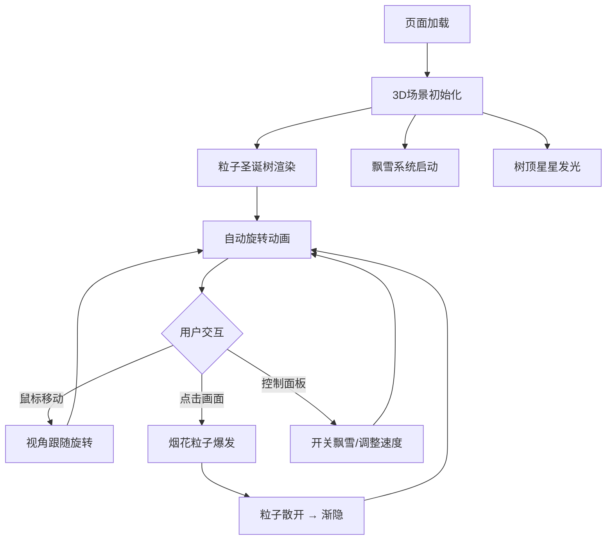

## 1. 产品概述
3D粒子圣诞树——一个沉浸式的节日视觉体验页面。成千上万个彩色光点螺旋排列构成旋转的圣诞树，搭配飘雪、烟花等动态效果，营造温馨节日氛围。适合在特殊日子分享给朋友或独自欣赏放松。
- 目标用户：希望在节日获得视觉享受的普通用户
- 核心价值：以高品质3D粒子效果带来沉浸式节日体验，可交互、可分享

## 2. 核心功能

### 2.1 功能模块
1. **主场景页面**：3D粒子圣诞树、飘雪效果、树顶星星、烟花特效、交互控制面板

### 2.2 页面详情
| 页面名称 | 模块名称 | 功能描述 |
|----------|----------|----------|
| 主场景 | 粒子圣诞树 | 数千个彩色光点螺旋排列成锥形圣诞树，持续自动旋转，光点颜色从底部暖色渐变到顶部冷色 |
| 主场景 | 树顶星星 | 树顶一颗高亮星点，带有脉冲发光动画，是整个场景最亮的焦点 |
| 主场景 | 飘雪效果 | 光点从上方缓缓飘落，模拟雪花，可开关 |
| 主场景 | 烟花特效 | 点击画面时，一束粒子从树顶迸发成烟花，短暂照亮场景后归于平静 |
| 主场景 | 鼠标交互 | 鼠标移动时树微微跟随旋转，可从不同角度观察锥形层次 |
| 主场景 | 控制面板 | 飘雪开关按钮、旋转速度滑块 |

## 3. 核心流程
用户打开页面 → 圣诞树场景加载呈现 → 树自动旋转 + 飘雪持续 → 用户移动鼠标改变视角 → 用户点击触发烟花 → 通过控制面板调整效果参数

## 4. 用户界面设计

### 4.1 设计风格
- 主色调：深邃暗蓝黑色背景（#0a0a1a），搭配金色（#FFD700）和节日红绿（#FF4444 / #44FF88）作为点缀
- 整体氛围：夜空般深邃、星光闪烁、温暖而神秘
- 字体：标题使用装饰性字体 Playfair Display，控制面板使用 DM Sans
- 布局：全屏3D场景，左下角半透明控制面板浮层

### 4.2 页面设计概览
| 页面名称 | 模块名称 | UI元素 |
|----------|----------|--------|
| 主场景 | 3D画布 | 全屏深色背景，粒子圣诞树居中，自动旋转 |
| 主场景 | 树顶星星 | 金色高亮点，脉冲发光，辐射光晕 |
| 主场景 | 飘雪粒子 | 白色/淡蓝色小光点，从上方随机飘落 |
| 主场景 | 烟花粒子 | 多彩粒子从树顶迸射，带拖尾渐隐 |
| 主场景 | 控制面板 | 半透明深色玻璃面板，飘雪开关、旋转速度滑块 |

### 4.3 响应式
- 桌面优先，全屏3D场景
- 移动端支持触摸交互（触摸旋转、点击烟花）

### 4.4 3D场景指引
- 环境：深色星空背景，无HDRI，纯黑环境光 + 点光源营造氛围
- 灯光：微弱环境光 + 树顶点光源（金色暖光）
- 相机：透视相机，45度俯角，适当距离，可随鼠标偏转
- 构图：圣诞树居中偏下，树顶星星为视觉焦点
- 交互：鼠标移动控制相机偏转，点击触发烟花
- 后处理：可选Bloom效果增强发光感
- 性能预算：粒子总数控制在15000以内，保持60fps
