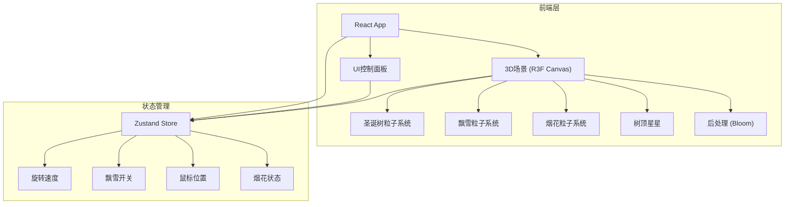

## 1. 架构设计


## 2. 技术说明
- 前端：React@18 + TypeScript + Vite
- 初始化工具：vite-init
- 3D渲染：Three.js + @react-three/fiber + @react-three/drei + @react-three/postprocessing
- 样式：Tailwind CSS@3
- 状态管理：Zustand
- 无后端

## 3. 路由定义
| 路由 | 用途 |
|------|------|
| / | 主场景页面，包含3D粒子圣诞树和所有交互 |

## 4. 核心组件设计

### 4.1 场景组件
| 组件名 | 职责 |
|--------|------|
| ChristmasTreeScene | 主3D场景容器，包含Canvas和所有3D子组件 |
| TreeParticles | 圣诞树粒子系统，螺旋排列的彩色光点 |
| StarTop | 树顶星星，高亮脉冲发光 |
| SnowSystem | 飘雪粒子系统，可开关 |
| FireworkSystem | 烟花粒子系统，点击触发 |
| Effects | 后处理效果（Bloom） |

### 4.2 UI组件
| 组件名 | 职责 |
|--------|------|
| ControlPanel | 控制面板，飘雪开关 + 旋转速度滑块 |

### 4.3 状态管理
```typescript
interface AppState {
  rotationSpeed: number
  snowEnabled: boolean
  mouseX: number
  mouseY: number
  fireworks: Firework[]
  triggerFirework: () => void
  setRotationSpeed: (speed: number) => void
  toggleSnow: () => void
  setMousePosition: (x: number, y: number) => void
}
```

## 5. 粒子系统算法

### 5.1 圣诞树粒子分布
- 锥形螺旋分布：从底部到顶部，半径逐渐缩小
- 参数：层数 ~30，每层点数随半径递减
- 颜色：底部红/金 → 中部绿 → 顶部蓝/白渐变
- 总粒子数：约8000-12000

### 5.2 飘雪粒子
- 随机分布在场景顶部区域
- 缓慢下落 + 水平漂移（正弦波）
- 落出视野后重置到顶部
- 粒子数：约2000

### 5.3 烟花粒子
- 从树顶位置发射
- 球形扩散 + 重力下坠
- 颜色：金色/红色/白色随机
- 生命周期：1-2秒渐隐
- 每次爆发粒子数：约200-500
